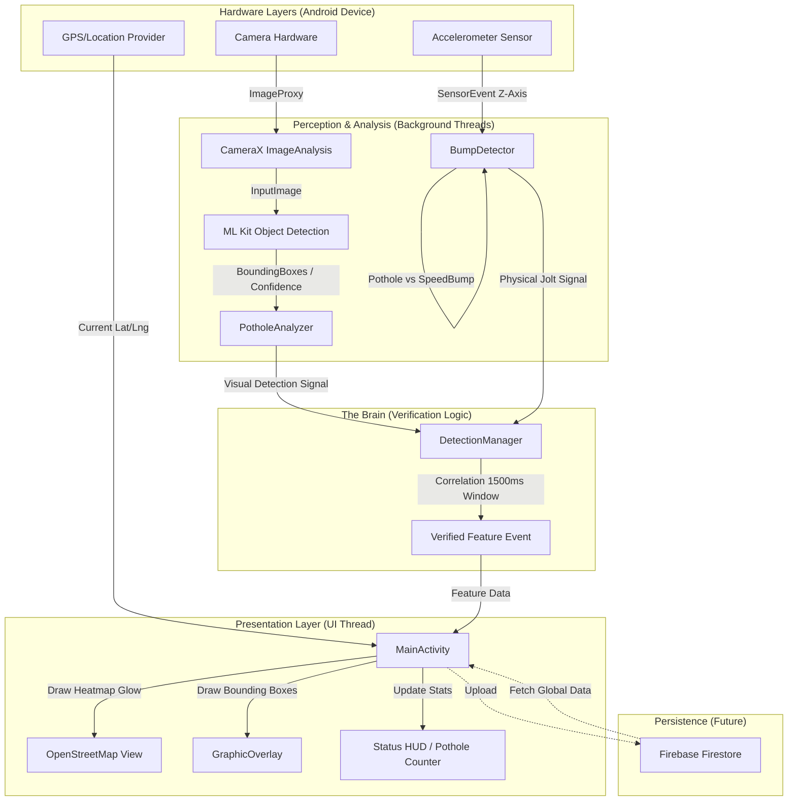

# RoadWise System Architecture Diagram

### Key Logic Paths:
1.  **Visual Path:** Camera $\rightarrow$ ML Kit $\rightarrow$ `PotholeAnalyzer` $\rightarrow$ `GraphicOverlay` (Real-time red boxes).
2.  **Physical Path:** Accelerometer $\rightarrow$ `BumpDetector` (Detection of jolt direction).
3.  **Verification Path:** Both signals meet in `DetectionManager`. If they align in time, it's a **Verified Pothole**.
4.  **Mapping Path:** Verified events are paired with **GPS coordinates** and drawn as a **Radial Glow** on the OpenStreetMap.
