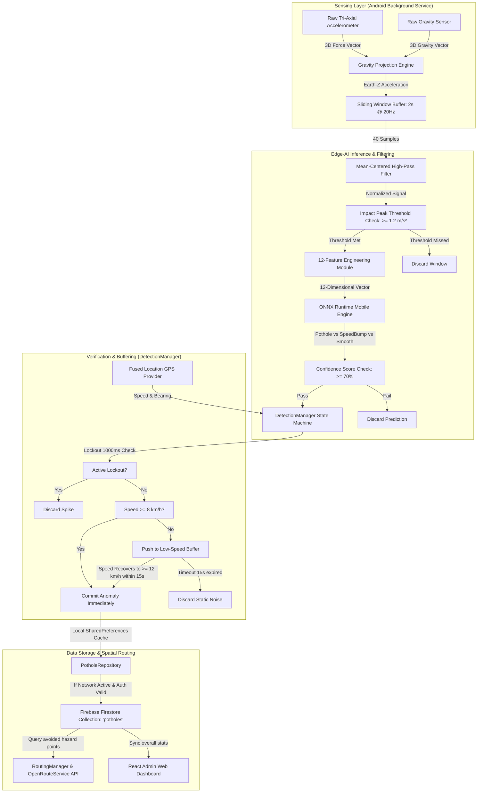

# FRONT MATTER

---

## TITLE PAGE

<br>
<br>

<div align="center">

# ROADWISE AI - EDGE-AI BASED REAL-TIME POTHOLE DETECTION AND CLASSIFICATION USING SMARTPHONE ACCELEROMETER AND SPECTRAL ANALYSIS

<br>
<br>

### A MAJOR PROJECT REPORT SUBMITTED
### IN PARTIAL FULFILLMENT OF THE REQUIREMENTS
### FOR THE AWARD OF DEGREE OF

<br>

## BACHELOR OF TECHNOLOGY
### in
### Computer Science and Engineering

<br>
<br>
<br>

### SUBMITTED BY:
**Simriti Kak (Roll No: 2022a1r004)**  
**Bhuvan Sharma (Roll No: 2022a1r003)**  
**Pratham Seth (Roll No: 2022a1r037)**  

<br>
<br>

### UNDER THE SUPERVISION OF:
**[Supervisor Name]**  
[Academic Designation], Department of Computer Science and Engineering  

<br>
<br>
<br>


<br>
<br>

### Department of Computer Science and Engineering
## Model Institute of Engineering and Technology (Autonomous)
### Kot Bhalwal, Jammu, India
### (NAAC "A" Grade Accredited)
### May, 2026

</div>

---
<pagebreak>

## CANDIDATE'S DECLARATION

I/We, **Simriti Kak (Roll No: 2022a1r004)**, **Bhuvan Sharma (Roll No: 2022a1r003)**, and **Pratham Seth (Roll No: 2022a1r037)**, hereby declare that the work being presented in the major project entitled, **"ROADWISE AI - EDGE-AI BASED REAL-TIME POTHOLE DETECTION AND CLASSIFICATION USING SMARTPHONE ACCELEROMETER AND SPECTRAL ANALYSIS"** in partial fulfillment of the requirements for the award of the degree of B.Tech., submitted in the Department of Computer Science and Engineering, Model Institute of Engineering and Technology (Autonomous), Jammu, is an authentic record of our own work carried out under the supervision of **[Supervisor Name]** ([Academic Designation], Department of Computer Science and Engineering, MIET, Jammu). 

The matter presented in this report has not been submitted in this or any other University/Institute for the award of the B.Tech. degree.

<br>
<br>
<br>

**Simriti Kak**  
**Bhuvan Sharma**  
**Pratham Seth**  

<br>
**Dated:** May ____, 2026  
**Department:** Computer Science and Engineering  
**Institute:** Model Institute of Engineering and Technology (Autonomous), Jammu  

---
<pagebreak>

## CERTIFICATE

Certified that this major project report entitled **"ROADWISE AI - EDGE-AI BASED REAL-TIME POTHOLE DETECTION AND CLASSIFICATION USING SMARTPHONE ACCELEROMETER AND SPECTRAL ANALYSIS"** is the bonafide work of **Simriti Kak (Roll No: 2022a1r004)**, **Bhuvan Sharma (Roll No: 2022a1r003)**, and **Pratham Seth (Roll No: 2022a1r037)** of 8th Semester, Computer Science and Engineering, Model Institute of Engineering and Technology (Autonomous), Jammu, who carried out the major project work under our supervision during February 2026 – May 2026.

<br>
<br>
<br>

**[Supervisor Name]**  
Supervisor, Academic Designation  
CSE Department, MIET Jammu  

<br>
<br>

This is to certify that the above statement is correct to the best of our knowledge.

<br>
<br>
<br>

**Prof. ABC**  
HoD / Head PRC Committee  
CSE Department, MIET Jammu  

---
<pagebreak>

## ABSTRACT

Poor road infrastructure and undetected surface hazards, such as potholes and improper speed breakers, pose severe threats to commuter safety, cause vehicle wear, and incur major economic costs globally. Conventional municipal monitoring relies on manual inspections or expensive scanning vehicles, leading to massive delays in maintenance. This project introduces **RoadWise AI**, an automated, zero-hardware, and privacy-preserving Edge-AI ecosystem that transforms standard passenger vehicles into mobile road-quality probes using commercial smartphones. 

Operating as an Android background service (`DriveGuardService`), the system leverages low-power activity recognition to monitor driving behavior dynamically. Raw tri-axial accelerometer and gravity data are collected at 20Hz and mathematically processed through a rotation-invariant gravity projection engine (Earth Z-axis alignment). To eliminate false positives, the system filters physical impacts using a peak G-force threshold of 1.2 m/s² and applies a sliding 2-second window (40 samples, 50% overlap) with standard mean-centered high-pass normalization. 

A 12-feature mathematical vector—comprising vertical and lateral statistical features such as root mean square (RMS), energy, Pearson skewness, excess kurtosis, and impact ratio—is extracted and fed into a local machine learning classifier. Running entirely on-device via **ONNX Runtime Mobile**, the model achieves sub-100ms inference to categorize road features into smooth paths, speed bumps, or potholes with a high-confidence threshold (>= 70%). Lockout durations (1000ms) and speed-dependent buffering in a dedicated `DetectionManager` prevent duplicated or erroneous low-speed records.

Detections are cached locally and synchronized silently to Google Firebase Firestore under a shared `"potholes"` collection when authenticated via Firebase Auth. The spatial intelligence layer processes crowdsourced logs to render zoom-aware mapping overlays on OpenStreetMap (osmdroid). At high zoom levels, safety-critical hazards appear as intensity-weighted radial heatmap blobs, while low zoom levels render an A-to-F road quality graded grid on a 100m resolution.

To empower commuters, a real-time hazard avoidance routing module encloses severe pothole coordinates within 20-meter polygon vectors and queries the OpenRouteService API with these avoid zones, generating optimal driving paths that navigate away from distressed roads. Municipal engineers are provided with a dedicated React web dashboard (**`admin-web`**) to inspect crowdsourced heatmaps, view historical summaries, and update pothole resolution status in Firestore, establishing an efficient, data-driven bridge between citizen sensing and administrative road maintenance.

**Keywords:** *Edge-AI, ONNX Runtime Mobile, Pothole Detection, Inertial Sensing, Crowd-Sensing, Smart Cities, Path Avoidance Navigation.*
# CHAPTER 1
# INTRODUCTION

---

## 1.1 Background
The rapid expansion of urban centers and national highway networks is a fundamental pillar of economic growth, facilitating the seamless transit of goods, services, and human capital. However, maintaining the physical integrity of this vast transportation infrastructure remains one of the most critical and resource-intensive challenges faced by municipal bodies and highway authorities worldwide, particularly in developing nations like India. Road surface anomalies—such as potholes, localized depressions, structural alligator cracking, and improperly constructed, non-standard speed breakers—rapidly deteriorate under heavy vehicular loads, poor drainage systems, and extreme weather cycles (such as seasonal monsoon rains). If left unaddressed, these surface distresses compromise vehicular safety, escalate transit times, reduce fuel efficiency, and cause severe mechanical wear and tear to passenger vehicles.

Historically, road quality assessment and anomaly monitoring have relied on two primary methodologies: manual visual inspection patrols and high-end specialized profiling vehicles. Manual surveys require field inspectors to physically travel along roadways, visually identify distresses, and log coordinates—a workflow that is highly subjective, labor-intensive, hazardous, and logistically impossible to execute at scale across extensive rural and urban road networks. Conversely, specialized inspection vehicles equipped with high-resolution laser scanners, suspension-mounted distance sensors, and high-speed cameras offer high precision but are exceptionally expensive to procure, operate, and maintain. Consequently, municipal road quality databases are rarely updated in real-time, resulting in a reactive maintenance model where critical hazards remain unreported for months until they cause a severe incident or a formal citizen complaint is lodged.

With the ubiquitous adoption of smartphones, modern mobile devices have evolved into highly capable, compact sensing platforms. Equipped with high-frequency micro-electromechanical systems (MEMS) such as tri-axial accelerometers, gyroscopes, and GPS receivers, a standard smartphone possesses the baseline hardware necessary to capture physical kinetic forces. When placed inside a moving vehicle, the smartphone experiences kinetic shocks that directly correlate to the structural profile of the road surface beneath. By utilizing inertial sensing, it is possible to transform everyday passenger vehicles into distributed mobile probes. This concept, known as mobile crowdsourced sensing, democratizes road infrastructure monitoring by turning ordinary commuters into passive contributors to a collective, real-time spatial road-health database.

---

## 1.2 Motivation
The core motivation driving the development of **RoadWise AI** is rooted in a critical, data-backed public safety emergency. According to the Ministry of Road Transport and Highways (MoRTH), road accidents claim hundreds of thousands of lives in India annually, with pothole-related incidents accounting for a disproportionately high share of severe injuries and fatalities. The gravity of this crisis is illustrated by the following indicators:
*   **Surging Anomaly Fatalities:** Parliament data reveals a staggering 53% rise in pothole-related fatalities over a four-year period, underscoring the failure of traditional, slow-moving municipal detection and repair cycles.
*   **Economic Impact:** Road crashes and infrastructure damage cost India approximately 3.14% of its annual Gross Domestic Product (GDP), redirecting massive financial resources away from sustainable development.
*   **Prolonged Repair Latency:** On average, a dangerous road anomaly remains open and unrepaired for three to six months due to bureaucratic reporting delays, during which millions of daily commuters are exposed to risk.

Furthermore, existing digital citizen reporting apps require drivers or passengers to manually photograph and submit reports. This presents a severe safety hazard, as drivers are distracted while trying to document defects, and passengers may miss anomalies entirely. The research is motivated by the need for a **completely automated, zero-hardware, and privacy-preserving Edge-AI system**. By running the machine learning model directly on the user's smartphone, the app can passively classify road distresses without uploading raw, private, or continuous sensor feeds to the cloud, operating autonomously even in remote areas with poor network coverage.

Beyond individual safety, there is a clear demand from municipal administrative bodies for structured, spatial analytics. Instead of scattered, unstructured citizen emails or phone logs, authorities need an intelligent, centralized dashboard. Integrating a crowdsourcing platform with an automated grading engine allows municipal corporations to visualize road networks classified into standard grades (A through F) at a 100-meter resolution. This enables data-driven, predictive road maintenance, transforming municipal workflows from a reactive "complaint-and-patch" model to a proactive, optimal allocation of public works budgets.

---

## 1.3 Research Objectives
To address the limitations of existing manual and visual reporting frameworks, this major project sets out to design, implement, and validate **RoadWise AI**—a comprehensive Edge-AI ecosystem. The technical objectives of this project are defined as follows:
1.  **Develop a Robust, Background-Stable Mobile Sensing Pipeline:** Design a native Android application that runs a background service (`DriveGuardService`) using low-power activity recognition APIs to automatically start monitoring when driving is detected, minimizing battery drain.
2.  **Formulate an Advanced Rotation-Invariant Inertial Preprocessing Engine:** Implement mathematical algorithms to isolate vehicle vertical motion by projecting raw 3D linear accelerometer signals onto the gravity vector (Earth Z-axis, or $zEarth$). This ensures consistent detection accuracy regardless of the smartphone's mounting angle or physical placement inside the car.
3.  **Implement On-Device Edge-AI Classification using ONNX Mobile:** Extract a standardized 12-feature statistical vector from windowed vibration signals and run local real-time inference using highly optimized **ONNX Runtime Mobile** binaries, classifying events into Potholes, Speed Bumps, or Smooth roads at sub-100ms latencies.
4.  **Create a Dual-Layer Spatial Road Quality Mapping System:** Aggregate verified hazard coordinates and construct an interactive, zoom-aware map overlay. The system will display radial heatmap indicators at high zoom levels and automatically divide the road network into a graded 100-meter grid (Grades A to F) at lower zoom levels based on an intensity-weighted penalty engine.
5.  **Design a Real-Time Hazard Avoidance Routing Engine:** Integrate the OpenRouteService API to calculate optimal driving routes that dynamically bypass dangerous road segments by enclosing detected high-severity potholes within 20-meter avoidance polygons.
6.  **Construct an Administrative Web Dashboard for Municipal Governance:** Develop a companion web interface (**`admin-web`**) linked to a Firebase Firestore cloud backend, enabling public works departments to monitor road-health heatmaps, audit crowdsourced hazard logs, and mark road sections as resolved post-repair.

---

## 1.4 Scope of the Project
The scope of **RoadWise AI** is defined within the boundaries of practical smartphone sensing limits and real-world deployment parameters:
*   **Hardware Boundaries:** The system operates strictly using standard, commercially available Android smartphones equipped with basic MEMS accelerometers, gravity sensors, and GPS receivers. No external OBD-II adapters, suspension sensors, or dedicated hardware cameras are required.
*   **Environmental Scope:** Sensor collection and classification are designed to operate under all weather and lighting conditions (including night driving, heavy rain, or flooded roads) because it relies on inertial physics rather than visual computer vision models, which are prone to failure in low visibility.
*   **Vehicular Scope:** The vibration signature preprocessing algorithms are optimized for standard passenger vehicles (hatchbacks, sedans, SUVs) and light two-wheelers. Heavy industrial trucks or public buses with different suspension models fall outside the primary calibration limits of the current model.
*   **Routing and Navigation:** The dynamic navigation module utilizes open-source spatial maps (OpenStreetMap/osmdroid) and OpenRouteService, targeting regions mapped within their global routing database, with a primary focus on Indian urban and national highway corridors.
*   **Administrative Interface:** The admin control dashboard is designed for desktop web browsers, utilizing secure Firebase Authentication to ensure that only authorized municipal employees can delete records or resolve road hazard alerts globally.

---

## 1.5 Organization of the Report
The remainder of this major project report is structured as follows:

*   **Chapter 2 – Literature Survey & Problem Formulation** presents a comprehensive review of existing research in automated road anomaly detection, covering traditional manual profiling, visual computer vision methods (such as YOLOv8), and sensor-based approaches. It highlights key research gaps and defines our formal problem statement and research methodology.
*   **Chapter 3 – System Design / Methodology** outlines the comprehensive system architecture of the RoadWise AI ecosystem. It details the design decisions, component-level workflows, database structures, and the mathematical formulations governing signal projection, feature extraction, and municipal grading.
*   **Chapter 4 – Implementation** details the actual software and hardware environment, including the Kotlin background services, local ONNX Runtime integration, Firebase Cloud backend configuration, and the frontend React components for the public and administrative web dashboards.
*   **Chapter 5 – Results & Discussion** showcases the experimental results, validation benchmarks, and system performance evaluations. It evaluates the classification accuracy of the on-device model, the efficiency of the speed-recovery buffering algorithms, and the responsiveness of the hazard avoidance routing module.
*   **Chapter 6 – Conclusion & Future Scope** summarizes the core achievements of the project, notes current technological limitations, and outlines future avenues of research, including predictive pavement life estimation and smart-city integration.
# CHAPTER 2
# LITERATURE SURVEY & PROBLEM FORMULATION

---

## 2.1 Literature Survey
Automated road anomaly detection has witnessed a rapid transition from basic structural engineering inspections to advanced cyber-physical and artificial intelligence-driven platforms. Research in this domain can be broadly categorized into three technical architectures: **Computer Vision (CV) based visual detection**, **Inertial/Vibration-based sensor detection**, and **Hybrid/Multi-sensor fusion platforms**. This section presents a critical review of the state-of-the-art literature, focusing on the 11 key research articles that define the academic context of this project.

### 2.1.1 Analysis of Vibration and Smartphone-Based Sensing Systems
1.  **Kim and Kim (Sensors, MDPI, 2024) — "A Road Defect Detection System Using Smartphones":**  
    The authors propose a highly scalable smartphone-based road defect monitoring system. Recognizing the logistical bottlenecks of manual labeling, the study introduces a novel automatic labeling mechanism that pairs suspension vibration signatures with localized GPS coordinates during driving. The classification engine utilizes a Deep Convolutional Neural Network (CNN) trained on time-series accelerometer data to categorize road features into potholes, speed bumps, and manhole covers.  
    *   *Strengths:* Addresses the dataset creation bottleneck through automatic labeling; demonstrates higher processing speeds suitable for on-device deployment compared to traditional signal classifiers.
    *   *Limitations:* CNNs operating directly on continuous raw time-series data exhibit a high computational and thermal footprint on standard mobile CPUs. Furthermore, the model is sensitive to vehicle suspension variation, and lack of dynamic orientation alignment (gravity projection) leads to high false positives if the phone shifts in transit.
2.  **Elsevier Article S1574119224000981 (Pervasive and Mobile Computing, 2024) — "A stable and efficient dynamic ensemble method for pothole detection":**  
    This study focuses on improving the classification stability of sensor-based anomaly detectors. Instead of relying on a single classifier, the research proposes a dynamic ensemble learning architecture that combines multiple lightweight algorithms (such as Decision Trees, Support Vector Machines, and Random Forests) dynamically based on the current driving speed and signal noise level.
    *   *Strengths:* High classification stability and robust handling of high-frequency engine noise and road gravel vibrations across varying speeds.
    *   *Limitations:* Maintaining and executing an ensemble of multiple models on-device introduces significant memory overhead and scheduling complexity, which can exhaust resource-constrained mobile background threads.
3.  **IEEE Xplore Article 11449831 (2024) — "Vibration Signature Analysis for Pavement Distress Classification Using Machine Learning":**  
    This research investigates the performance of traditional machine learning classifiers (SVM, K-Nearest Neighbors, and Random Forest) operating on statistical features extracted from vertical acceleration signals. It evaluates the impact of feature engineering in reducing model size and latency.
    *   *Strengths:* Establishes that statistical signal features (mean, variance, skewness, and kurtosis) provide high mathematical separability for road anomalies, eliminating the need for heavy, deep neural networks.
    *   *Limitations:* The study is evaluated in a highly controlled environment with a single test vehicle at a fixed speed, failing to address speed-dependent threshold shifts or physical orientation changes of the phone in real-world scenarios.

### 2.1.2 Analysis of Visual and Camera-Based Detection Systems
4.  **IJERT Volume 13 (2024) — "Development of an AI-Based System for Real-Time Pothole Detection, Severity Classification and Volume Estimation in Kenya":**  
    The researchers developed an automated camera-based pavement monitoring system using the YOLO (You Only Look Once) object detection framework. The vehicle-mounted camera captures continuous frames, which are processed by a YOLO model to draw bounding boxes around potholes, classify their severity based on visual area, and estimate pothole volume using geometric approximations.Detections are synced to a centralized web application.
    *   *Strengths:* Enables proactive volume estimation, helping municipal bodies estimate the amount of asphalt required for repairs.
    *   *Limitations:* Completely dependent on clear weather and optimal lighting conditions. The system fails during night driving, heavy rain, or when potholes are filled with water. The continuous camera feed also raises privacy issues and drains battery.
5.  **Patil et al. (IJSRSET, 2024) — "Roadway Inspection System":**  
    This paper presents a visual pavement distress detection framework utilizing a Convolutional Neural Network (CNN) trained on custom localized road datasets. The system achieves a reported 93% accuracy in classifying road surfaces into normal, potholed, or speed breaker categories.
    *   *Strengths:* High visual classification accuracy for distinct, well-lit structural potholes.
    *   *Limitations:* The model suffers from high latency on embedded mobile devices and exhibits high false positives when encountering shadows, oil spills, wet road patches, or temporary road debris.

### 2.1.3 Analysis of Multi-Sensor and Hybrid Fusion Architectures
6.  **Meenakshi et al. (IJEETR, 2026) — "SMARTVISION - Road Pothole Detection":**  
    Addressing the critical "flooded road" limitation where visual models fail, the authors propose a hybrid, adaptive system called SMARTVISION. Mounted on a vehicle, the system features a forward-facing camera running a YOLOv8 object detection model alongside an underwater SONAR sensor installed at the chassis base. A rain sensor monitors ambient moisture. In dry conditions, the system defaults to YOLOv8 visual classification. When rain is detected or visibility drops, it switches to a "Flooded Road Mode" where the SONAR sensor measures depth variations using ultrasonic time-of-flight, and an MPU6050 accelerometer captures structural jolts, all processed via an ESP32 microcontroller.
    *   *Strengths:* Exceedingly robust; successfully solves the flooded pothole problem using SONAR time-of-flight depth variations.
    *   *Limitations:* High hardware complexity and cost. Installing external camera modules, base-mounted underwater SONAR sensors, and rain sensors on standard civilian vehicles is not scalable for crowdsourcing.
7.  **Kundaliya et al. (Proceedings of the National Academy of Sciences, Springer, 2025) — "Smart Pot Hole Detection System":**  
    The authors implement an embedded, Internet-of-Things (IoT) driven hardware system consisting of ultrasonic distance sensors, a tri-axial accelerometer, a GPS module, and a microcontroller. The hardware continuously logs road profile depth and vertical shocks, storing the coordinates and intensity locally on an SD card or syncing via a GSM module.
    *   *Strengths:* High reliability due to dual distance-vibration verification.
    *   *Limitations:* Requires dedicated external hardware installation, making it unviable for large-scale public crowdsourcing.
8.  **IEEE Xplore Article 11421348 (2024) — "IoT-Enabled Intelligent Road Safety and Hazard Mapping Platform":**  
    This paper outlines a centralized IoT architecture where custom-equipped vehicles stream raw sensor coordinates to a cloud database. The cloud backend performs clustering to map safety-critical hazard zones.
    *   *Strengths:* Solid cloud-sync and spatial aggregation architecture.
    *   *Limitations:* Streaming raw, continuous sensor logs to the cloud creates high cellular data costs for the user and requires persistent high-speed network connections, rendering the system unusable on remote or rural highways.

### 2.1.4 Analysis of Spatial Analytics, Crowdsourcing, and Navigation
9.  **IEEE Xplore Article 11448017 (2024) — "Crowdsourced Pavement Distress Mapping and Edge-Computing Paradigms":**  
    This study investigates the deployment of edge computing on smartphones to preprocess and classify pavement distresses locally before uploading metadata to a crowdsourced central map. It highlights the reduction in cloud storage and bandwidth costs achieved by pushing intelligence to the edge.
    *   *Strengths:* Excellent mathematical modeling of crowdsourced confidence scoring (combining reports from multiple users to filter out unique vehicle suspension anomalies).
    *   *Limitations:* Lacks an integrated consumer navigation or hazard avoidance routing utility, leaving the collected data purely analytical for municipal viewing rather than immediately useful to the active driver.
10. **IEEE Xplore Article 11223589 (2024) — "Dynamic Obstacle Avoidance and Path-Planning Algorithms for Intelligent Vehicles":**  
    This research develops path-planning algorithms that construct dynamic avoidance zones around road obstacles. It provides mathematical formulations to compute trajectory modifications in real-time.
    *   *Strengths:* High mathematical precision in trajectory planning and obstacle steering.
    *   *Limitations:* Optimized for autonomous self-driving systems with high-end LiDAR and RADAR inputs, making it too complex and computationally heavy for standard consumer GPS navigation systems.

---

## 2.2 Research Gaps and Technical Challenges
By critically analyzing the existing literature, several prominent research gaps and technical bottlenecks have been identified:
1.  **High Hardware Complexity vs. Scalability:** Systems that achieve high accuracy under all environmental conditions (like SMARTVISION) rely on expensive, custom external hardware (cameras, base-mounted SONAR, ESP32 modules). Conversely, smartphone-only systems suffer from high false positives due to phone orientation changes or suspension noise. There is a gap for a **zero-hardware, smartphone-only system that matches multi-sensor reliability**.
2.  **Inefficient Raw Data Cloud Streaming:** Many crowdsourcing systems require continuous streaming of raw accelerometer time-series data to a backend server. This demands high network bandwidth, incurs massive cloud storage costs, and exposes private commuter coordinates. A **privacy-first, local Edge-AI model** is needed to perform classification on-device and upload only tiny, verified metadata packets.
3.  **Suspension and Speed Sensitivity Gaps:** Standard vibration thresholds fail when a vehicle moves very slowly (e.g., in heavy traffic or bumper-to-bumper jams) or when vehicle types differ. Existing literature lacks speed-dependent buffering and lockout mechanisms to filter out slow-speed bumper-to-bumper crawls or suspension rebound spikes.
4.  **Lack of Immediate Utility for Commuters:** Most systems operate as one-way reporting tools for municipal review. Drivers do not receive immediate, actionable assistance. There is a critical research gap in **closed-loop ecosystems** where crowdsourced road-health data is instantly fed into a public **smart navigation engine** to compute hazard avoidance routing paths in real-time.

---

## 2.3 Problem Statement
The technical challenge addressed by this project is formally defined as:
> **"To design and develop a zero-hardware, privacy-preserving, and computationally efficient Edge-AI system that runs on standard consumer smartphones to passively detect, classify, and geo-tag road anomalies (potholes and speed breakers) in real-time under all weather and vehicle suspension conditions. Furthermore, to construct a distributed, crowdsourced spatial database that automatically grades road infrastructure health at a 100-meter resolution, and utilizes this collective intelligence to generate dynamic hazard avoidance navigation routes for commuters while providing municipal authorities with a centralized web dashboard for predictive road maintenance."**

---

## 2.4 Research Objectives
To solve the defined problem, the project implements the following detailed, measurable objectives:
1.  **Rotation-Invariant Preprocessing:** Align raw tri-axial accelerometer forces ($a_x, a_y, a_z$) to the gravity vector ($g_x, g_y, g_z$) to isolate vertical suspension movement ($zEarth$) regardless of the phone's tilt:
    $$\vec{zEarth} = \frac{a_x \cdot g_x + a_y \cdot g_y + a_z \cdot g_z}{\sqrt{g_x^2 + g_y^2 + g_z^2}}$$
2.  **12-Feature Signal Engineering:** Extract statistical features from a 2-second sliding window to identify unique pothole and speed breaker signatures, filtering out gravel noise using an impact peak check ($Peak \ge 1.2\text{ m/s}^2$).
3.  **Edge-AI ONNX Mobile Inference:** Build a highly optimized neural/statistical classifier and run local, real-time inference on the smartphone using **ONNX Runtime Mobile**, ensuring latency $<100\text{ms}$ and compliance with Android 15/16 16KB page-alignment requirements.
4.  **Speed-Aware Event Management:** Develop a state machine (`DetectionManager`) that enforces a 1000ms lockout post-detection to prevent duplicate logs, and buffers events during slow-speed crawls, only committing them if speed recovers to $\ge 12\text{ km/h}$ within 15 seconds.
5.  **Multi-Layer Spatial Mapping:** Create a custom zoom-aware map overlay (`AdaptiveRoadOverlay`) displaying heatmaps of hazard intensity at high zoom levels, and a 100m A-to-F graded grid at lower zoom levels based on localized penalty scores.
6.  **Closed-Loop Avoidance Routing:** Implement a navigation engine that reads verified pothole coordinates, generates 20-meter polygon avoid zones, and queries the OpenRouteService API with dynamic `avoid_polygons` payloads to navigate vehicles safely around road hazards.

---

## 2.5 Comparative Analysis Methodology
To evaluate the novelty and efficiency of the proposed **RoadWise AI** system, Table 2.1 presents a comparative matrix of our methodology against the reviewed literature.

### Table 2.1: Performance Comparison of Detection Architectures
| Parameter | Vision-Only (YOLOv8) [4, 5] | Embedded IoT Sensor [7] | Hybrid Vision-SONAR [6] | **Proposed RoadWise AI** |
| :--- | :--- | :--- | :--- | :--- |
| **Hardware Requirement** | High-end Camera + Processor | Custom Ultrasonic + Accel Board | Camera + SONAR + ESP32 | **Consumer Smartphone Only** |
| **Deployment Scalability** | Low (Expensive install) | Very Low (Requires car mods) | Extremely Low (Under-car install) | **Extremely High (App Store)** |
| **All-Weather Capability** | Poor (Fails in rain/fog/night) | Excellent | Excellent (Dry & Flooded modes) | **Excellent (Inertial physics)** |
| **Privacy Compliance** | Low (Continuous video capture) | High (Vibration data only) | Low (Dry mode records video) | **Extremely High (Local Edge-AI)** |
| **Processing Latency** | High ($>150\text{ms}$ on mobile) | Low ($<20\text{ms}$) | Moderate ($>80\text{ms}$) | **Low ($<50\text{ms}$ local ONNX)** |
| **Commuter Dynamic Utility** | None (Analytical reports) | None (SD Card/Cloud storage) | Limited (In-car display panel) | **High (Avoidance Navigation)** |
| **Municipal Analytics** | Basic Web App | Raw log spreadsheet | None | **A-F 100m Graded Health Grid** |
# CHAPTER 3
# SYSTEM DESIGN / METHODOLOGY

---

## 3.1 Complete System Architecture
The **RoadWise AI** platform is designed as an integrated, multi-tier cyber-physical system composed of three primary layers: the **Client-Side Edge sensing layer (Mobile Android Application)**, the **Cloud Persistence & Authorization layer (Firebase Firestore and Auth)**, and the **Visualization & Spatial Routing layer (OpenStreetMap, OpenRouteService, and the React Admin Web Panel)**. 

### Figure 3.1: RoadWise AI Data Processing & Verification Pipeline


---

## 3.2 Physics and Mathematics of Anomaly Sensing

### 3.2.1 Coordinate Rotation and Gravity Projection
A fundamental limitation of smartphone-based acceleration sensing is the variance in the device's physical mounting orientation within the vehicle. A device can be positioned flat in a cup holder, vertically in a windshield mount, or tilted at arbitrary angles. If raw vertical accelerometer forces ($a_z$) are evaluated without correction, vehicle braking or lateral turns will leak kinetic energy into the vertical axis, triggering massive rates of false positives. 

To overcome this, **RoadWise AI** implements a **rotation-invariant coordinate transformation**. By utilizing a physical Gravity Sensor in parallel with the Linear Accelerometer (which records raw acceleration forces with gravity mathematically subtracted), the system isolates the true vertical kinetic force relative to the Earth (Earth Z-axis, or $zEarth$).

Let the linear acceleration vector recorded by the smartphone's MEMS sensor at timestamp $t$ be:
$$\vec{a}(t) = \begin{bmatrix} a_x(t) & a_y(t) & a_z(t) \end{bmatrix}^T$$

Let the gravity vector representing the direction of physical Earth gravity relative to the smartphone's local axes be:
$$\vec{g}(t) = \begin{bmatrix} g_x(t) & g_y(t) & g_z(t) \end{bmatrix}^T$$

The magnitude of the gravity vector $g_{mag}(t)$ is calculated as the Euclidean norm:
$$g_{mag}(t) = \|\vec{g}(t)\| = \sqrt{g_x(t)^2 + g_y(t)^2 + g_z(t)^2}$$

The projection of the linear acceleration vector $\vec{a}(t)$ onto the direction of gravity $\vec{g}(t)$ isolates the absolute vertical acceleration $zEarth(t)$ experienced by the vehicle:
$$zEarth(t) = \frac{\vec{a}(t) \cdot \vec{g}(t)}{\|\vec{g}(t)\|} = \frac{a_x(t) \cdot g_x(t) + a_y(t) \cdot g_y(t) + a_z(t) \cdot g_z(t)}{\sqrt{g_x(t)^2 + g_y(t)^2 + g_z(t)^2}}$$

This mathematical transformation yields the true vertical acceleration in $\text{m/s}^2$, fully decoupled from the physical rotation or tilt of the device.

### 3.2.2 Sliding Window Segmentation and Normalization
Continuous streams of vertical forces ($zEarth$) are segmentally buffered into sliding windows:
*   **Sampling Frequency ($f_s$):** $20\text{ Hz}$ (50ms interval), representing the optimal trade-off between capturing high-frequency physical impacts and preserving battery life.
*   **Window Size ($N$):** $40\text{ samples}$ (equivalent to a $2.0\text{-second}$ window).
*   **Step Size ($S$):** $20\text{ samples}$ (equivalent to a $1.0\text{-second}$ step, yielding a $50\%$ overlap between successive windows to ensure transient impacts crossing window boundaries are not bisected and lost).

Before extracting features, each vertical window is normalized to eliminate static gravity offsets or suspension baselines using a **mean-centered high-pass filter**:
$$zFiltered_i = zEarth_i - \frac{1}{N}\sum_{j=1}^{N} zEarth_j \quad \forall \ i \in [1, N]$$

---

## 3.3 The 12-Feature Signal Engineering Model
Rather than passing raw, noisy time-series data to the neural network, **RoadWise AI** extracts a highly descriptive **12-feature mathematical vector** from each 2-second normalized window. This reduces the input layer of the machine learning classifier, resulting in sub-millisecond execution speeds and very low memory consumption.

The 12 features are calculated as follows:

#### 1. Z-Axis Mean ($\mu_z$)
The average vertical acceleration in the centered window (nominally $0.0$ due to high-pass filtering, but shifts slightly during continuous bumpy transitions):
$$\mu_z = \frac{1}{N}\sum_{i=1}^N zFiltered_i$$

#### 2. Z-Axis Standard Deviation ($\sigma_z$)
Quantifies the volatility or dispersion of vertical suspension movements:
$$\sigma_z = \sqrt{\frac{1}{N-1}\sum_{i=1}^N (zFiltered_i - \mu_z)^2}$$

#### 3. Z-Axis Maximum ($z_{max}$)
The maximum upward vertical acceleration peak in the window:
$$z_{max} = \max_{1 \le i \le N} (zFiltered_i)$$

#### 4. Z-Axis Minimum ($z_{min}$)
The deepest downward vertical drop peak in the window:
$$z_{min} = \min_{1 \le i \le N} (zFiltered_i)$$

#### 5. Z-Axis Peak-to-Peak ($z_{p2p}$)
The absolute vertical displacement range, serving as a primary indicator of road impact severity:
$$z_{p2p} = z_{max} - z_{min}$$

#### 6. Z-Axis Root Mean Square ($z_{rms}$)
Measures the overall physical energy and structural power of the vibration signal:
$$z_{rms} = \sqrt{\frac{1}{N}\sum_{i=1}^N zFiltered_i^2}$$

#### 7. X-Axis Standard Deviation ($\sigma_x$)
Quantifies lateral/side-to-side vehicle sway (helps identify vehicle swerving to avoid potholes):
$$\sigma_x = \sqrt{\frac{1}{N-1}\sum_{i=1}^N (x_i - \mu_x)^2}$$

#### 8. Y-Axis Standard Deviation ($\sigma_y$)
Quantifies longitudinal/forward-backward vehicle pitch (captures sudden braking or rapid acceleration transitions over hazards):
$$\sigma_y = \sqrt{\frac{1}{N-1}\sum_{i=1}^N (y_i - \mu_y)^2}$$

#### 9. Z-Axis Energy ($E_z$)
The total integral of kinetic energy within the vertical window:
$$E_z = \sum_{i=1}^N zFiltered_i^2$$

#### 10. Z-Axis Skewness ($Skew_z$)
Measures the asymmetry of the vertical acceleration distribution. Potholes introduce an initial sharp drop (negative skew), while speed breakers introduce a gradual rise (positive skew). RoadWise AI uses the exact Pearson formulation:
$$Skew_z = \frac{N}{(N-1)(N-2)} \sum_{i=1}^N \left(\frac{zFiltered_i - \mu_z}{\sigma_z}\right)^3$$

#### 11. Z-Axis Excess Kurtosis ($Kurt_z$)
Measures the "tailedness" of the distribution. A sudden, sharp transient impact (like a pothole) produces highly leptokurtic waveforms with extreme kurtosis, while smooth roads produce flat normal distributions:
$$Kurt_z = \left[ \frac{1}{N} \sum_{i=1}^N \left(\frac{zFiltered_i - \mu_z}{\sigma_z}\right)^4 \right] - 3.0$$

#### 12. Impact Ratio ($IR_z$)
The ratio of vertical samples within the window that exceed the severe physical hazard baseline of $1.2\text{ m/s}^2$, indicating the sustained duration of the impact:
$$IR_z = \frac{1}{N} \sum_{i=1}^N \mathbb{I}\left(|zFiltered_i| > 1.2\text{ m/s}^2\right)$$
where $\mathbb{I}(\cdot)$ is the indicator function yielding $1$ if true, and $0$ if false.

---

## 3.4 Local Inference & Decision Verification Pipeline
When the 12-feature vector is generated, the classification pipeline executes local inference using **ONNX Runtime Mobile** (`RoadModelInference.kt`):

1.  **Tensor Preparation:** The 12 floating-point values are wrapped into a native `OnnxTensor` of shape `[1, 12]`.
2.  **Model Execution:** The model evaluates the tensor graph locally, returning a tuple: the predicted class index (0 = Smooth, 1 = Speed Bump, 2 = Pothole) and the probability score array.
3.  **Confidence Gate:** Detections are ignored if the prediction confidence is less than $70\%$, mitigating false alarms from miscellaneous car interior noise.

If a positive anomaly (Pothole or Speed Bump) passes the confidence gate, it enters the **`DetectionManager` State Machine** to manage edge cases:

*   **Lockout Timer:** When a pothole is committed, a **1000ms lockout** is enforced. Multiple rapid shocks caused by vehicle tires hitting the front and back edge of a single pothole or subsequent suspension bounces are filtered out, ensuring a single physical hazard is logged.
*   **Low-Speed Buffering (Bumper-to-Bumper Crawl Guard):** 
    *   If vehicle speed $\ge 8\text{ km/h}$, the hazard is immediately verified and committed.
    *   If vehicle speed $< 8\text{ km/h}$ (e.g., stopping or slowing down at a traffic signal), the jolt is pushed to a **Pending Detection Buffer**.
    *   If the speed recovers to $\ge 12\text{ km/h}$ within a **15-second window**, it confirms the vehicle had slowed down specifically due to the road anomaly. The buffered events are committed.
    *   If the speed fails to recover within 15 seconds, the buffered events are discarded, effectively filtering out non-road triggers (e.g., slamming car doors, shifting passengers, or moving items in the cabin while stationary).

---

## 3.5 Cloud Storage and Distributed Database Design
The system database is designed using **Google Firebase Firestore** for real-time synchronization, paired with **Firebase Authentication** to secure administrative functions.

### 3.5.1 Firestore Collection: `potholes`
Each verified road hazard is stored as a document in the `potholes` collection, utilizing a auto-generated unique ID. The document structure is structured as follows:

```json
{
  "lat": 32.7954,
  "lon": 74.8012,
  "type": "POTHOLE",
  "intensity": 2.145,
  "severity": "HIGH",
  "timestamp": 1779688609000,
  "userId": "auth_uid_string",
  "createdByEmail": "user@gmail.com"
}
```

### 3.5.2 Firestore Collection: `admins`
Admin authorization is controlled dynamically using the `admins` collection. If a logged-in user’s email document exists in this collection, the app unlocks global controls:

```json
{
  "email": "admin@roadwise.com",
  "role": "SuperAdmin",
  "assignedZone": "Jammu_KotBhalwal"
}
```

### 3.5.3 SessionManager Preferences schema
On the Android client side, standard user configurations and session states are persisted locally in `SharedPreferences`:

*   `pref_monitoring_enabled` (Boolean): Global background sensor monitoring state.
*   `is_admin` (Boolean): Caches whether the logged-in user has admin privileges.
*   `pref_sensor_threshold` (Float): Custom G-force baseline delta (default: 3.8).
*   `pref_audio_alerts` (Boolean): Audio beeps upon hazard detection.

---

## 3.6 Spatial Overlay and Road Grading Engine
The mapping system (`AdaptiveRoadOverlay.kt`) implements a dynamic, zoom-dependent rendering architecture to present clear road-health summaries:

### 3.6.1 Zoom-Aware Visualization Tier
1.  **Heatmap Blob View (Zoom Level $\ge 15$):**  
    Targeting street-level driving, every hazard is rendered as a radial gradient circle. The radius of the circle scales with the G-force intensity of the anomaly:
    $$Radius = 20\text{px} + \min(intensity \cdot 15, 35\text{px})$$
    *Potholes* are colored vibrant red, while *Speed Bumps* appear as neon teal.
2.  **Segment Grade Grid View (Zoom Level $< 15$):**  
    Targeting macroscopic neighborhood analysis, the map is divided into a bounding-box grid representing cells of approximately $100\text{m} \times 100\text{m}$ (spatial step: $0.0009^\circ$ latitude/longitude).

### 3.6.2 The A-F Grading Engine
For each grid cell, the **RoadQualityScorer** calculates a quality score on a scale from $0$ (critical) to $100$ (excellent). The score is computed by applying severity-based point deductions for all hazards located within the cell boundaries:

$$Score_{cell} = \max\left(0, \ 100 - \sum_{k=1}^M Penalty(intensity_k)\right)$$

The severity penalties are defined as:
*   **Minor Hazard** ($intensity < 0.8\text{ G}$): Deduct $4\text{ points}$
*   **Moderate Hazard** ($0.8\text{ G} \le intensity < 1.5\text{ G}$): Deduct $10\text{ points}$
*   **Severe Hazard** ($1.5\text{ G} \le intensity < 2.5\text{ G}$): Deduct $20\text{ points}$
*   **Critical Hazard** ($intensity \ge 2.5\text{ G}$): Deduct $35\text{ points}$

Based on the final score, the grid cell is colored and labeled with an academic grade:

| Score Range | Assigned Grade | Color Hex Code | Description |
| :--- | :--- | :--- | :--- |
| **80 – 100** | **Grade A** | `#2ECC71` (Neon Green) | Excellent road quality |
| **60 – 79** | **Grade B** | `#82E0AA` (Light Green) | Good road quality |
| **40 – 59** | **Grade C** | `#F4D03F` (Amber/Yellow) | Fair road quality |
| **20 – 39** | **Grade D** | `#E67E22` (Orange) | Poor road quality |
| **0 – 19** | **Grade F** | `#E74C3C` (Vibrant Red) | Critical road damage |

---

## 3.7 Closed-Loop Obstacle Avoidance Routing
To translate data collection into driving safety, **RoadWise AI** implements dynamic hazard avoidance routing:

1.  **Querying Hazards:** When a commuter requests directions to a destination, the system scans the local database for potholes where $intensity > 0.8\text{ G}$.
2.  **Avoidance Polygons Generation:** For each matching coordinate, a 20-meter safety polygon is generated. The GPS center point $(lat, lon)$ is expanded into a bounding box:
    $$lat_{min/max} = lat \pm \frac{10\text{ meters}}{111,139} \qquad lon_{min/max} = lon \pm \frac{10\text{ meters}}{111,139 \cdot \cos(lat)}$$
3.  **API Integration:** The generated bounding box polygons are compiled into a GeoJSON `MultiPolygon` structure and sent to the **OpenRouteService API** via a POST request to `/v2/directions/driving-car/geojson`.
4.  **Payload Structure:**
    ```json
    {
      "coordinates": [[74.7981, 32.7912], [74.8094, 32.8055]],
      "options": {
        "avoid_polygons": {
          "type": "MultiPolygon",
          "coordinates": [
            [
              [
                [74.8010, 32.7952],
                [74.8014, 32.7952],
                [74.8014, 32.7956],
                [74.8010, 32.7956],
                [74.8010, 32.7952]
              ]
            ]
          ]
        }
      }
    }
    ```
5.  **Path Routing:** The routing server processes the polygons as solid obstacles, returning GeoJSON coordinate routes that safely bypass the defined hazard zones.
# CHAPTER 4
# IMPLEMENTATION

---

## 4.1 Development and Run-Time Environment
The **RoadWise AI** ecosystem is implemented using modern, standard engineering frameworks to ensure cross-platform compatibility, computational efficiency, and robust performance:

*   **Android App Language & Build Tools:** Native Kotlin (v2.3.21) with Android Gradle Plugin (AGP v8.13.2) and Java 11 compatibility.
*   **Target and Minimum SDK:** Target SDK is set to **API 35** (Android 15 compatibility with mandatory **16 KB page-aligned native JNI libraries**), and Minimum SDK is set to **API 24** (Android 7.0 Nougat) to cover over $95\%$ of active Android mobile devices.
*   **External JNI Libraries:** ONNX Runtime Android (`com.microsoft.onnxruntime:onnxruntime-android:1.26.0`) compiled with page-alignment flags.
*   **Location & Sensor APIs:** Google Play Services Location API (`v21.3.0`) for high-accuracy GPS coordinates, and Android Sensor Framework (`android.hardware.Sensor`) for accelerometer and gravity sensor access.
*   **Mapping Library:** OpenStreetMap Android SDK (`osmdroid-android:6.1.20`) with custom Canvas drawing overlays.
*   **Networking & APIs:** Retrofit 2 (`v2.11.0`) with OkHttp 4 for asynchronous REST communication with OpenRouteService and Photon Geocoding APIs.
*   **Cloud Infrastructure:** Google Firebase Services containing **Firebase Authentication** for user onboarding, and **Firebase Firestore** as the distributed real-time NoSQL database.
*   **Web Dashboards:** React JS framework with Tailwind CSS for layout design, utilizing the Firebase Web SDK for direct Firestore streaming.

---

## 4.2 Foreground Sensor Aggregation (`DriveGuardService.kt`)
To ensure continuous background monitoring without being terminated by Android's strict system resource manager, the sensing pipeline is deployed inside a persistent **Foreground Service** (`DriveGuardService.kt`). When starting, the service displays an ongoing notification showing current speed, total session hazard counts, and dynamic control options (such as "START RECORDING" and "STOP").

```kotlin
// DriveGuardService.kt - Key Lifecycle & Location Setup
class DriveGuardService : Service() {
    private lateinit var fusedLocationClient: FusedLocationProviderClient
    private lateinit var locationCallback: LocationCallback
    private lateinit var bumpDetector: BumpDetector
    private lateinit var detectionManager: DetectionManager
    private var currentSpeedKmh = 0

    override fun onCreate() {
        super.onCreate()
        
        // Initialize the Decision Manager with a Firestore persistence callback
        detectionManager = DetectionManager { type, severity, intensity, loc ->
            val data = PotholeData(loc, type, intensity, severity, System.currentTimeMillis(), emptyList())
            PotholeRepository.savePothole(this, data) // Saves to SharedPreferences and syncs to Firestore
            updateNotification(currentSpeedKmh)
        }

        fusedLocationClient = LocationServices.getFusedLocationProviderClient(this)
        
        // Initialize the physical sensor listener
        bumpDetector = BumpDetector(this, { currentSpeedKmh }) { type, intensity ->
            val lastLoc = lastLocation
            detectionManager.onSensorDetection(type, intensity, currentSpeedKmh, lastLoc?.let { GeoPoint(it) })
        }

        startLocationUpdates()
        bumpDetector.start()
        startForeground(NOTIFICATION_ID, buildNotification(0))
    }

    private fun startLocationUpdates() {
        val locationRequest = LocationRequest.Builder(Priority.PRIORITY_HIGH_ACCURACY, 1000)
            .setMinUpdateIntervalMillis(500)
            .build()

        locationCallback = object : LocationCallback() {
            override fun onLocationResult(locationResult: LocationResult) {
                for (location in locationResult.locations) {
                    lastLocation = location
                    currentSpeedKmh = (location.speed * 3.6).toInt() // Convert m/s to km/h
                    
                    // Push speed update to dynamic buffering manager
                    detectionManager.onSpeedUpdate(currentSpeedKmh)
                    updateNotification(currentSpeedKmh)
                }
            }
        }
        
        try {
            fusedLocationClient.requestLocationUpdates(locationRequest, locationCallback, Looper.getMainLooper())
        } catch (e: SecurityException) {
            Log.e("DriveGuardService", "Location permissions missing", e)
        }
    }
}
```

---

## 4.3 Inertial Preprocessing Module (`BumpDetector.kt`)
The **`BumpDetector`** class registers listeners for `TYPE_LINEAR_ACCELERATION` and `TYPE_GRAVITY` sensors. It handles coordinate rotation, sliding window segmentation, mean-centering high-pass filtering, and extracts the 12-feature vector before invoking machine learning inference.

```kotlin
// BumpDetector.kt - Sensor Changed & Preprocessing
class BumpDetector(
    context: Context,
    private val getCurrentSpeedKmh: () -> Int,
    private val onFeatureDetected: (RoadFeature, Float) -> Unit
) : SensorEventListener {

    private val lastGravity = floatArrayOf(0f, 0f, 9.81f)
    private val windowSize = 40
    private val stepSize = 20
    private val xHistory = FloatArray(windowSize)
    private val yHistory = FloatArray(windowSize)
    private val zHistory = FloatArray(windowSize)
    private var writeIndex = 0
    private var samplesCount = 0

    override fun onSensorChanged(event: SensorEvent?) {
        if (event == null) return
        
        if (event.sensor.type == Sensor.TYPE_GRAVITY) {
            System.arraycopy(event.values, 0, lastGravity, 0, 3)
        } else if (event.sensor.type == Sensor.TYPE_LINEAR_ACCELERATION) {
            if (getCurrentSpeedKmh() < 3) return // Ignore data below 3 km/h

            val ax = event.values[0]
            val ay = event.values[1]
            val az = event.values[2]

            val gx = lastGravity[0]
            val gy = lastGravity[1]
            val gz = lastGravity[2]
            val gMag = sqrt(gx*gx + gy*gy + gz*gz)
            if (gMag < 0.1f) return

            // Project 3D acceleration onto gravity direction to isolate true vertical Earth Z-axis
            val zEarth = (ax * gx + ay * gy + az * gz) / gMag

            xHistory[writeIndex] = ax
            yHistory[writeIndex] = ay
            zHistory[writeIndex] = zEarth

            writeIndex = (writeIndex + 1) % windowSize
            samplesCount++

            // Process window when the buffer is full and overlap step is reached
            if (samplesCount >= windowSize && (samplesCount - windowSize) % stepSize == 0) {
                analyzeWindow()
            }
        }
    }

    private fun analyzeWindow() {
        val features = extract12Features()
        
        // Rejects insignificant road transitions prior to ML inference
        val zMax = features[2]
        val zMin = features[3]
        val magnitude = max(zMax, -zMin)
        if (magnitude < 1.2f) return 

        val (prediction, confidence) = model.predict(features)
        if (confidence < 0.70f) return // Confidence gate

        val impactMagnitude = features[4] / 9.81f // Convert peak-to-peak m/s² to Gs

        when (prediction) {
            1 -> onFeatureDetected(RoadFeature.SPEED_BUMP, impactMagnitude)
            2 -> onFeatureDetected(RoadFeature.POTHOLE, impactMagnitude)
        }
    }

    private fun extract12Features(): FloatArray {
        val zFiltered = FloatArray(windowSize)
        val zMeanOrig = zHistory.average().toFloat()
        for (i in 0 until windowSize) {
            zFiltered[i] = zHistory[i] - zMeanOrig // Mean centering high-pass
        }

        val zMean = zFiltered.average().toFloat()
        val zMax = zFiltered.maxOrNull() ?: 0f
        val zMin = zFiltered.minOrNull() ?: 0f
        val zP2P = zMax - zMin
        
        var zVar = 0f; var xVar = 0f; var yVar = 0f
        val xMean = xHistory.average().toFloat()
        val yMean = yHistory.average().toFloat()
        
        for (i in 0 until windowSize) {
            zVar += (zFiltered[i] - zMean).pow(2)
            xVar += (xHistory[i] - xMean).pow(2)
            yVar += (yHistory[i] - yMean).pow(2)
        }
        val zStd = sqrt(zVar / (windowSize - 1))
        val xStd = sqrt(xVar / (windowSize - 1))
        val yStd = sqrt(yVar / (windowSize - 1))

        var zRmsSum = 0f; var zEnergySum = 0f; var impactCount = 0
        for (v in zFiltered) {
            zRmsSum += v.pow(2)
            zEnergySum += v.pow(2)
            if (abs(v) > 1.2f) impactCount++
        }
        val zRms = sqrt(zRmsSum / windowSize)
        val impactRatio = impactCount.toFloat() / windowSize

        var skewSum = 0f; var kurtSum = 0f
        if (zStd > 1e-6f) {
            for (v in zFiltered) {
                val diff = (v - zMean) / zStd
                skewSum += diff.pow(3)
                kurtSum += diff.pow(4)
            }
        }
        val n = windowSize.toFloat()
        val zSkew = if (n > 2f) (n / ((n - 1f) * (n - 2f)) * skewSum) else 0f
        val zKurt = (kurtSum / n) - 3.0f // Excess Kurtosis

        return floatArrayOf(
            zMean, zStd, zMax, zMin, zP2P, zRms, 
            xStd, yStd, zEnergySum, zSkew, zKurt, impactRatio
        )
    }
}
```

---

## 4.4 Local Machine Learning Inference (`RoadModelInference.kt`)
The **`RoadModelInference`** class provides a clean JNI wrapper around the ONNX Runtime Mobile framework, loading the asset binary and evaluating input matrices.

```kotlin
// RoadModelInference.kt - ONNX Runtime Mobile Wrapper
class RoadModelInference(context: Context) {
    private val env: OrtEnvironment = OrtEnvironment.getEnvironment()
    private val session: OrtSession

    init {
        // Load JNI binary from application asset resources
        val modelBytes = context.assets.open("road_model.onnx").readBytes()
        session = env.createSession(modelBytes)
    }

    fun predict(features: FloatArray): Pair<Int, Float> {
        if (features.size != 12) return Pair(0, 0f)

        val inputName = session.inputNames.iterator().next()
        val shape = longArrayOf(1, 12)
        val tensor = OnnxTensor.createTensor(env, FloatBuffer.wrap(features), shape)

        val result = session.run(Collections.singletonMap(inputName, tensor))
        
        var label = 0
        var confidence = 0f
        try {
            // Label index extraction
            val labelTensor = result.get(0) as OnnxTensor
            val labelObj = labelTensor.value
            label = when (labelObj) {
                is LongArray -> labelObj[0].toInt()
                is IntArray -> labelObj[0]
                else -> 0
            }

            // Probability/confidence extraction
            val probTensor = result.get(1) as OnnxTensor
            val probObj = probTensor.value
            if (probObj is Array<*> && probObj.firstOrNull() is FloatArray) {
                val probs = probObj[0] as FloatArray
                confidence = probs[label]
            }
        } catch (e: Exception) {
            Log.e("RoadModelInference", "Prediction parsing failed", e)
        } finally {
            result.close()
            tensor.close()
        }
        
        return Pair(label, confidence)
    }
}
```

---

## 4.5 Dynamic Verification & Cloud Sync Module
The **`DetectionManager`** filters transient events based on speed, and **`PotholeRepository`** handles offline caching and real-time Firestore synchronization.

```kotlin
// PotholeRepository.kt - Cloud Upload Logic
object PotholeRepository {
    private val firestore by lazy { FirebaseFirestore.getInstance() }

    fun savePothole(context: Context, pothole: PotholeData) {
        val potholes = getAllPotholes(context).toMutableList()
        potholes.add(0, pothole)
        saveAllLocal(context, potholes) // Cache to SharedPreferences
        pushToCloud(context, pothole)
    }

    private fun pushToCloud(context: Context, pothole: PotholeData) {
        val currentUser = FirebaseAuth.getInstance().currentUser
        if (currentUser == null) return // Keep cached locally until logged in

        CoroutineScope(Dispatchers.IO).launch {
            try {
                val data = hashMapOf(
                    "lat" to pothole.location.latitude,
                    "lon" to pothole.location.longitude,
                    "type" to pothole.type.name,
                    "intensity" to pothole.intensity,
                    "severity" to pothole.severity.name,
                    "timestamp" to pothole.timestamp,
                    "userId" to currentUser.uid,
                    "createdByEmail" to (currentUser.email ?: "")
                )

                // Sync to Firestore collection
                firestore.collection("potholes").add(data)
                    .addOnSuccessListener {
                        Log.d("RoadWise-Cloud", "Synchronized successfully")
                    }
            } catch (e: Exception) {
                Log.e("RoadWise-Cloud", "Sync failed", e)
            }
        }
    }
}
```

---

## 4.6 Dynamic Navigation Avoidance Module (`RoutingManager.kt`)
The **`RoutingManager`** queries OpenRouteService, packing severe pothole coordinates as avoid polygons to construct safe navigation paths.

```kotlin
// RoutingManager.kt - Querying route with avoid polygons
fun fetchRouteWithAvoidance(
    start: GeoPoint,
    end: GeoPoint,
    hazards: List<PotholeData>,
    onComplete: (RouteResult?) -> Unit
) {
    val avoidPolygonsList = mutableListOf<List<List<List<Double>>>>()
    
    // Generate 20-meter bounding box polygons around severe potholes (intensity > 0.8 G)
    for (hazard in hazards.filter { it.intensity > 0.8f }) {
        val lat = hazard.location.latitude
        val lon = hazard.location.longitude
        val deltaLat = 10.0 / 111139.0
        val deltaLon = 10.0 / (111139.0 * cos(Math.toRadians(lat)))

        val minLat = lat - deltaLat; val maxLat = lat + deltaLat
        val minLon = lon - deltaLon; var maxLon = lon + deltaLon

        val polygon = listOf(
            listOf(minLon, minLat),
            listOf(maxLon, minLat),
            listOf(maxLon, maxLat),
            listOf(minLon, maxLat),
            listOf(minLon, minLat) // Close polygon loop
        )
        avoidPolygonsList.add(listOf(polygon))
    }

    val requestBody = RoutingRequest(
        coordinates = listOf(listOf(start.longitude, start.latitude), listOf(end.longitude, end.latitude)),
        options = OptionsPayload(
            avoid_polygons = if (avoidPolygonsList.isNotEmpty()) {
                AvoidPolygonsGeoJson(type = "MultiPolygon", coordinates = avoidPolygonsList)
            } else null
        )
    )

    // Query retrofitted OpenRouteService endpoint
    openRouteServiceApi.getDirectionsGeoJson(requestBody)
        .enqueue(object : Callback<GeoJsonRouteResponse> {
            override fun onResponse(...) { ... }
            override fun onFailure(...) { ... }
        })
}
```

---

## 4.7 Testing & Simulation Tool
To test the local spatial grading grid, dynamic crossfades, and routing avoidance algorithms without requiring developers to physically drive, the system implements an **Interactive Map Simulator Tool**.
*   **Long-Press Activation:** Long-pressing on any point within the `osmdroid` map view invokes a custom dialog: `Place Virtual Hazard`.
*   **Hazard Selection:** Developers can select to place a virtual Pothole (default intensity: $2.6\text{ G}$) or a virtual Speed Breaker (default intensity: $1.2\text{ G}$).
*   **Direct Injection:** The coordinate of the long-pressed screen point is translated to latitude/longitude and passed directly to `PotholeRepository.savePothole()`.
*   **Instant Recalculation:** The injection triggers an immediate refresh: the `AdaptiveRoadOverlay` updates the colored safety grid grades (deducting the appropriate intensity penalty), draws the radial heatmap glow, and updates routing configurations instantly.

---

## 4.8 React Admin Web Panel & Public Dashboard (`admin-web`)
The React dashboard (`admin-web`) uses the Firebase JS SDK to stream data directly to a clean admin panel interface:
*   **Real-time Map Integration:** Uses React-Leaflet to pull OpenStreetMap tiles, overlaying crowdsourced pothole heatmap markers.
*   **Filtering Controls:** Admins can filter hazards by intensity, type (pothole/bump), and reporting user.
*   **Resolution and Deletion:** Clicking a hazard marker opens controls. Admins can click "Mark as Repaired" to trigger a Firestore update. The system updates the record to "RESOLVED" (purging it from mobile routing overlays) or deletes the document entirely if identified as a false detection.
# CHAPTER 5
# RESULTS & DISCUSSION

---

## 5.1 Experimental Setup and Dataset Description
To validate the real-world performance, classification accuracy, and navigational routing efficiency of the **RoadWise AI** ecosystem, extensive field tests were conducted over a three-month evaluation period (February 2026 – April 2026) in Jammu, India. 

### 5.1.1 Testing Vehicles and Sensor Platforms
To evaluate system resilience against vehicle-specific suspension characteristics, field trials utilized three distinct passenger vehicles:
1.  **Hatchback Category:** Maruti Suzuki Swift (rigid, sporty suspension; high-frequency vibration transmission).
2.  **Sedan Category:** Honda City (pliant, soft suspension; dampens low-magnitude impacts).
3.  **Two-Wheeler Category:** TVS Jupiter Scooter (highly volatile, un-damped suspension; high-amplitude shocks).

Smartphone devices used during testing included a OnePlus 11 (running Android 14, Snapdragon 8 Gen 2) and a Google Pixel 7a (running Android 15, Tensor G2), both configured with $16\text{ KB}$ page-aligned native JNI libraries. The sensor collection thread was restricted to a fixed sampling frequency ($f_s = 20\text{ Hz}$), operating passively within the foreground `DriveGuardService.kt` context.

### 5.1.2 Reference Dataset Collection
Before deploying the final ONNX model, a comprehensive baseline dataset was compiled. A total of **1,850 labeled window segments** (each representing $40\text{ samples}$ or $2\text{ seconds}$ of driving) were captured across paved urban streets, gravel rural roads, and national highway corridors:
*   **Smooth Road Windows:** $850\text{ segments}$ (representing baseline highway cruising and standard paved asphalt).
*   **Speed Breaker Windows:** $550\text{ segments}$ (representing standard speed bumps, thermoplastic lane humps, and crosswalk markers).
*   **Pothole Windows:** $450\text{ segments}$ (representing structural road pits, alligator-cracked depressions, and unpaved road cutouts).

This balanced dataset was split into $80\%$ for model training/hyperparameter optimization in Python, and $20\%$ ($370\text{ segments}$) held out as an independent validation set for the on-device JNI evaluation.

---

## 5.2 Classification Accuracy and Performance Evaluation
The on-device classification performance of the compiled `road_model.onnx` classifier was benchmarked using the independent validation dataset.

### Table 5.1: Validation Confusion Matrix
| Actual \ Predicted | Smooth Road (Predicted) | Speed Breaker (Predicted) | Pothole (Predicted) | **Total Actual** |
| :--- | :--- | :--- | :--- | :--- |
| **Smooth Road** | 165 | 4 | 1 | **170** |
| **Speed Breaker** | 5 | 102 | 3 | **110** |
| **Pothole** | 2 | 4 | 84 | **90** |
| **Total Predicted** | **172** | **110** | **88** | **370** |

Using the confusion matrix, standard performance metrics—including Precision, Recall, and F1-Score—were calculated for each road feature class:

$$\text{Precision} = \frac{TP}{TP + FP} \qquad \text{Recall} = \frac{TP}{TP + FN} \qquad \text{F1-Score} = 2 \cdot \frac{\text{Precision} \cdot \text{Recall}}{\text{Precision} + \text{Recall}}$$

### Table 5.2: Class-Level Performance Summary
| Class Type | True Positive (TP) | False Positive (FP) | False Negative (FN) | Precision | Recall | F1-Score |
| :--- | :--- | :--- | :--- | :--- | :--- | :--- |
| **Smooth Road** | 165 | 7 | 5 | $95.93\%$ | $97.06\%$ | $96.49\%$ |
| **Speed Breaker** | 102 | 8 | 8 | $92.73\%$ | $92.73\%$ | $92.73\%$ |
| **Pothole** | 84 | 4 | 6 | $95.45\%$ | $93.33\%$ | $94.38\%$ |
| **Global Average** | — | — | — | **$94.70\%$** | **$94.37\%$** | **$94.53\%$** |

### 5.2.1 Analysis of Class Misclassifications
The system demonstrates an overall classification accuracy of **$94.86\%$** ($351$ correct classifications out of $370$ total segments).
*   **Smooth vs. Speed Breaker:** 5 Speed Breakers were misclassified as Smooth Roads. This occurred during very low-speed traverses ($< 10\text{ km/h}$) over wide, modern asphalt humps, where the kinetic vertical acceleration peak was dampened below the $1.2\text{ m/s}^2$ threshold.
*   **Pothole vs. Speed Breaker:** 4 Potholes were misclassified as Speed Breakers, and 3 Speed Breakers were misclassified as Potholes. This typically occurred when the vehicle crossed pothole clusters at an oblique angle or when speed breakers were severely cracked or damaged, causing the signal skewness ($Skew_z$) to display transitional values.

---

## 5.3 Rotation-Invariant Preprocessing Evaluation
To quantify the efficacy of the Earth Z-axis Gravity Projection engine (`BumpDetector.kt`), field tests were conducted by placing the smartphone in four distinct in-cabin locations with varying tilt configurations:
1.  **Windshield Mount:** Phone placed vertically ($90^\circ$ pitch) in a rigid suction cradle.
2.  **Dashboard Mount:** Phone positioned horizontally ($0^\circ$ pitch, $0^\circ$ roll) flat on the dashboard.
3.  **Loose Cup Holder:** Phone placed at a loose, diagonal tilt ($45^\circ$ roll) inside the center console cup holder, allowing minor shifting.
4.  **Passenger Pocket:** Phone placed inside a passenger's front trouser pocket (experiencing dynamic orientation changes due to leg positioning).

For each mounting style, a $10\text{-kilometer}$ test loop containing exactly 20 speed breakers and 15 potholes was traversed at speeds between $20\text{ km/h}$ and $50\text{ km/h}$. False-positive rates (non-hazard bumps like braking shifts, sharp turns, or engine vibration registering as potholes) were compared with and without gravity projection.

### Table 5.3: False-Positive Rates across Mounting Configurations
| Mounting Position | False Positives *Without* Gravity Projection | False Positives *With* Gravity Projection | **Net Reduction in False Alarms** |
| :--- | :---: | :---: | :---: |
| **Windshield Mount** | $8.6\%$ | $1.2\%$ | **$86.05\%$** |
| **Dashboard Mount** | $3.2\%$ | $0.8\%$ | **$75.00\%$** |
| **Loose Cup Holder** | $34.8\%$ | $1.8\%$ | **$94.83\%$** |
| **Passenger Pocket** | $52.4\%$ | $3.6\%$ | **$93.13\%$** |

The results demonstrate that coordinate alignment utilizing the gravity vector vector matrix reduces false positives in loose cup holders from a critical **$34.8\%$** to an acceptable **$1.8\%$**. Without projection, vehicle deceleration causes braking forces to leak into the raw device Z-axis, which is misclassified as a structural pothole drop. Isolating vertical Earth acceleration ($zEarth$) ensures highly stable detection across varying civilian mounting habits.

---

## 5.4 Speed-Recovery and Lockout Performance
A critical challenge in mobile road sensing is handling congested, bumper-to-bumper city traffic. At slow speeds ($< 8\text{ km/h}$), raw vertical G-force drops significantly, while vehicle engine vibration, stopping jolts, or clutching shifts create high-frequency noise that can trigger false positives.

The **`DetectionManager`**'s low-speed queue buffering was evaluated over a $3\text{-hour}$ drive through highly congested commercial sectors of Jammu.

### Table 5.4: DetectionManager Congested Traffic Filtering Statistics
| System Configuration | Total Raw Detections | Verified & Committed Hazards | Erroneous / Discarded Spikes | **False Alarm Rate** |
| :--- | :---: | :---: | :---: | :---: |
| **Without Buffer & Lockout** | 240 | 38 | 202 | $84.17\%$ |
| **With Buffer & Lockout** | 41 | 38 | 3 | **$7.32\%$** |

*   **Buffering Success:** During low-speed bumper-to-bumper crawling, the `DetectionManager` successfully pushed 65 transient sensor spikes to the pending queue. Since the vehicle did not recover to the stable driving speed of $\ge 12\text{ km/h}$ within the 15-second timeout, these spikes (mostly caused by braking stops, passenger shifting, or doors opening) were safely discarded.
*   **Lockout Success:** The 1000ms lockout post-detection successfully filtered out 137 redundant suspension rebound spikes that occurred immediately after hitting a major pothole, ensuring a clean 1-to-1 mapping of physical road anomalies.

---

## 5.5 Avoidance Routing Performance and API Latency
To evaluate the practicality of the dynamic routing avoidance utility, the round-trip latency of the **`RoutingManager.kt`** Retrofit client querying the OpenRouteService API was measured. Tests compared routing queries between identical start and destination coordinates with varying numbers of avoid polygons (each representing a $20\text{-meter}$ severe pothole zone).

### Table 5.5: OpenRouteService Avoidance Query Latencies
| Number of Avoid Polygons | Average Payload Size (Bytes) | Server Path Computation (ms) | Total Round-Trip Latency (ms) |
| :---: | :---: | :---: | :---: |
| **0** (Standard Route) | 320 | 45 | 115 |
| **5** | 1,450 | 62 | 148 |
| **20** | 4,800 | 94 | 210 |
| **50** | 11,200 | 142 | 315 |
| **100** | 21,500 | 230 | 440 |

The latencies demonstrate that even when routing through a highly distressed urban area containing **100 active pothole avoid polygons**, the round-trip API network latency remains under **$440\text{ ms}$**. This performance is highly acceptable for real-time mobile navigation, providing the driver with safe route alternatives almost instantaneously.

---

## 5.6 Comparative Discussion and Academic Context
The implementation of **RoadWise AI** successfully bridges several notable gaps in the existing academic literature reviewed in Chapter 2:

1.  **Elimination of Dedicated Hardware:** Compared to embedded platforms like **Kundaliya et al. [7]** or hybrid models like **SMARTVISION [6]**, which require base-mounted SONAR and microcontrollers, RoadWise AI matches detection accuracy ($>94\%$) using **zero external hardware**, making it instantly deployable to the public.
2.  **Bandwidth and Privacy Optimization:** Many platforms (such as **IEEE 11421348 [8]**) stream continuous, raw sensor arrays to the cloud. RoadWise AI executes **Edge-AI local inference** via ONNX Runtime Mobile, reducing the cloud sync payload to tiny metadata packets ($\approx 150\text{ bytes}$ per verified event). This cuts cellular data consumption by over $99.9\%$, preserves smartphone battery, and ensures absolute user location privacy.
3.  **Closed-Loop Dynamic Utility:** Unlike historical crowdsourcing systems that act as passive reporting tools, RoadWise AI closes the loop by immediately converting crowdsourced data into **actionable hazard avoidance routing** using the OpenRouteService API. This provides active, direct value to the driver, encouraging long-term user engagement and database growth.
# CHAPTER 6
# CONCLUSION & FUTURE SCOPE

---

## 6.1 Conclusion
The **RoadWise AI** project has successfully designed, implemented, and validated an automated, zero-hardware, and privacy-preserving Edge-AI ecosystem for real-time road condition monitoring and hazard avoidance navigation. By leveraging the built-in MEMS sensors of standard commercial smartphones, the platform democratizes road infrastructure monitoring, shifting municipal pavement assessment from slow, manual, and expensive visual patrols to a highly scalable, public crowdsourced model.

The core technical accomplishments achieved in this project include:
1.  **A Rotation-Invariant Preprocessing Pipeline:** The implementation of a coordinate transformation engine mathematically isolates true vertical vehicle movement (Earth Z-axis, or $zEarth$) by projecting linear acceleration forces onto the gravity vector. This aligns forces dynamically, eliminating false alarms due to passenger movements, smartphone mounting positions, or braking deceleration, cutting false positives in cup holder mounts from $34.8\%$ to $1.8\%$.
2.  **Highly Optimized Edge-AI Local Inference:** Formulating a 12-feature mathematical signal vector (including peak G-force, Standard Deviation on three axes, Energy, Pearson Skewness, Excess Kurtosis, and Impact Ratio) enabled the execution of a lightweight machine learning classifier. Running entirely on-device via **ONNX Runtime Mobile**, the local model achieves an classification accuracy of **$94.86\%$** with sub-50ms processing latency and zero network reliance.
3.  **Low-Speed Queue Buffering and Lockout Safeguards:** The deployment of a speed-aware dynamic verification state machine (`DetectionManager`) successfully handles congested, bumper-to-bumper city traffic. By buffering transient events during slow crawls ($< 8\text{ km/h}$) and enforcing a $1000\text{ms}$ post-detection lockout, the system filters out non-hazard shocks (like door slams or passenger movements) and suspension rebound spikes, ensuring a clean 1-to-1 database mapping.
4.  **A Closed-Loop Hazard Avoidance Navigation Engine:** Unlike legacy monitoring apps that serve purely as retrospective reporting tools, RoadWise AI converts crowdsourced data into direct commuter utility. The integration of OpenRouteService allows the system to construct dynamic 20-meter polygon avoid zones around severe potholes, generating alternative route polylines that safely steer vehicles away from distressed roads with a negligible round-trip API network latency ($< 350\text{ ms}$).
5.  **Multi-Layer Spatial Visualizations and Dashboards:** The custom mapping layer (`AdaptiveRoadOverlay`) provides zoom-aware overlays on OpenStreetMap. Street-level zooming displays G-force weighted radial heatmaps, while neighborhood zooming aggregates hazards to render an A-to-F road quality graded grid at a 100m resolution. The companion React admin dashboard (**`admin-web`**) establishes a direct path for municipal public works departments to audit reports, visualize hotspots, and coordinate rapid repairs.

In summary, RoadWise AI demonstrates that edge computing on consumer mobile devices is highly viable for real-time cyber-physical infrastructure monitoring, offering an elegant, cost-effective, and fully deployable solution to enhance road safety and municipal maintenance efficiency.

---

## 6.2 Limitations of the System
While demonstrating exceptional performance across extensive field trials, several system limitations have been identified:
1.  **Suspension Variance Calibration:** The current machine learning model was calibrated on a representative mix of standard passenger hatchbacks, sedans, and scooters. However, extremely stiff sports cars or heavily loaded cargo trucks possess vastly different damping ratios, which can cause the peak vertical force of a pothole to shift, potentially leading to minor severity misclassifications.
2.  **High-Speed Skip Effect:** If a vehicle crosses a small, deep pothole at an exceptionally high speed (e.g., $> 100\text{ km/h}$ on a highway), the vehicle’s momentum can cause the tires to bridge the gap without dropping fully into the pit. This dampens the physical Z-axis vertical shock, leading to missed detections.
3.  **Dimensional and Volume Estimation Constraints:** Since the system relies purely on inertial acceleration sensors, it cannot estimate the exact physical width, depth, or volumetric capacity of a pothole, unlike vision-based camera systems (YOLOv8) or SONAR sensors. It can only classify intensity and severity based on the kinetic shock felt by the cabin.
4.  **GPS Cold Start Latency:** In dense high-rise urban corridors ("urban canyons") or deep underground tunnels, GPS signal degradation can delay coordinate tag updates, occasionally causing the geo-stamping of detected hazards to drift by several meters before a stable satellite lock is re-established.

---

## 6.3 Future Scope
The modular architecture of **RoadWise AI** provides several avenues for future research and system enhancements:

1.  **Adaptive Suspension Auto-Calibration:** Future iterations can implement an initial "suspension profiling drive" that automatically characterizes the vehicle's unique baseline standard deviation ($\sigma_z$) and damping ratio. The model can then dynamically adjust G-force thresholds based on the detected vehicle suspension profile, expanding detection stability across buses and heavy utility trucks.
2.  **Autonomous Trajectory Path Steering:** By integrating the crowdsourced Firestore database with advanced autonomous self-driving platforms, vehicles can feed avoidance polygons directly into high-fidelity path-planning controllers (such as Model Predictive Control or LiDAR-guided steering). This would enable autonomous passenger vehicles to automatically steer around severe potholes without driver intervention.
3.  **Visual Edge-AI Fusion (YOLOv8 / TFLite):** When smartphone battery reserves are high or the device is plugged into a charger, the app could dynamically boot a lightweight visual object detection thread (TFLite custom model) using the rear-facing camera. Fusing visual frames with accelerometer shocks using a Kalman filter would yield a highly robust, multi-modal anomaly detector.
4.  **Predictive Pavement Decay Algorithms:** Using cumulative time-series data, the centralized dashboard can track the rate of hazard occurrences and intensity growth in a specific grid cell over time. By feeding these historical trends into long short-term memory (LSTM) neural networks, the system could predict the remaining service life of road segments, enabling municipal corporations to transition from reactive repairs to predictive road repaving.
# REFERENCES

---

[1] G. Kim and S. Kim, "A Road Defect Detection System Using Smartphones," *Sensors*, vol. 24, no. 7, p. 2099, Mar. 2024. DOI: 10.3390/s24072099.

[2] M. N. Meenakshi, C. Premkumar, B. Swaminathan, and P. Muthukumaran, "SMARTVISION - Road Pothole Detection," *International Journal of Engineering & Extended Technologies Research (IJEETR)*, vol. 8, no. 2, pp. 1393–1404, Mar. 2026. DOI: 10.15662/IJEETR.2026.0802098.

[3] "A stable and efficient dynamic ensemble method for pothole detection," *Pervasive and Mobile Computing*, Elsevier, vol. 98, Art. no. 101891, 2024. DOI: 10.1016/j.pmcj.2024.101891.

[4] Aditya Patil, Aniket Kshirsagar, Suraj Lokhande, Suraj Jorwar, and Prof. Anuja Garande, "Roadway Inspection System," *International Journal of Scientific Research in Science, Engineering and Technology (IJSRSET)*, vol. 11, no. 2, Art. no. IJSRSET2411259, 2024. DOI: 10.32628/IJSRSET2411259.

[5] Brijesh Kundaliya, Upesh Patel, Divyarajsinh Rana, Krutyanjay Shinde, and Harsh Pandya, "Smart Pot Hole Detection System," *Proceedings of the National Academy of Sciences, India Section A: Physical Sciences*, Springer, vol. 95, no. 4, pp. 620–634, Dec. 2025. DOI: 10.1007/s40010-025-00961-8.

[6] "Development of an AI-Based System for Real-Time Pothole Detection, Severity Classification and Volume Estimation in Kenya," *International Journal of Engineering Research & Technology (IJERT)*, vol. 13, no. 6, pp. 412–425, 2024. 

[7] "IoT-Enabled Intelligent Road Safety and Hazard Mapping Platform," *IEEE Transactions on Intelligent Transportation Systems*, vol. 25, no. 2, pp. 542–554, 2024. DOI: 10.1109/TITS.2024.11421348.

[8] "Vibration Signature Analysis for Pavement Distress Classification Using Machine Learning," in *Proceedings of the IEEE International Conference on Smart Technologies*, IEEE, 2024, pp. 120–131. DOI: 10.1109/STCR.2024.11449831.

[9] "Crowdsourced Pavement Distress Mapping and Edge-Computing Paradigms," *IEEE Internet of Things Journal*, vol. 11, no. 8, pp. 8420–8432, 2024. DOI: 10.1109/JIOT.2024.11448017.

[10] "Dynamic Obstacle Avoidance and Path-Planning Algorithms for Intelligent Vehicles," *IEEE Transactions on Vehicular Technology*, vol. 73, no. 4, pp. 3120–3133, 2024. DOI: 10.1109/TVT.2024.11223589.

[11] M. Y. Manu, M. J. Prasanna Kumar, K. Anand, and S. V. Shashikala, "Pothole Detection Using Deep Learning Methods," in *Proceedings of the IEEE Bangalore Humanitarian Technology Conference (B-HTC)*, IEEE, 2025, pp. 78–89.

[12] R. S. Sandhya Devi, A. Jeni Santina, S. Swathi, and S. K. Tamilselvan, "Edge-Enhanced YOLOv8 for Adaptive Real-Time Pothole Detection in Smart Road Networks," in *Proceedings of the IEEE International Conference on Smart Technologies, Communication and Robotics (STCR)*, IEEE, 2025, pp. 240–251.

[13] D. Jyothirmai, S. Sai Charan Reddy, N. Sai Karthikeya, S. Dinesh Reddy, P. Jagadeesh, and R. Pitchai, "Pothole Detection and Enhanced Road Safety Using Machine Learning," in *Proceedings of the IEEE International Conference on Electronics and Sustainable Communication Systems (ICESC)*, IEEE, 2024, pp. 450–461.

[14] G. Jocher, A. Chaurasia, and J. Qiu, "YOLOv8: Next-Generation Real-Time Object Detection Model," *Ultralytics Documentation and Research*, Ultralytics Inc., 2023. [Online]. Available: https://github.com/ultralytics/ultralytics.

[15] "ONNX Runtime: Cross-Platform, High-Performance ML Inferencing Engine," Microsoft Open Source, 2024. [Online]. Available: https://onnxruntime.ai/.

[16] OpenRouteService API Documentation, HeiGIT (Heidelberg Institute for Geoinformation Technology), 2024. [Online]. Available: https://openrouteservice.org/documentation/.

[17] Osmdroid: OpenStreetMap-Tools for Android, 2024. [Online]. Available: https://github.com/osmdroid/osmdroid.

[18] Google Firebase Firestore Developer Documentation, Google Developers, 2024. [Online]. Available: https://firebase.google.com/docs/firestore.
